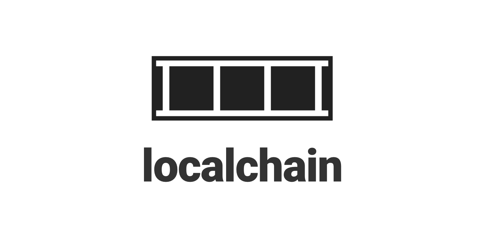

# localchain

> Dead simple offchain bitcoin transaction ledger.



localchain lets you easily create as many offchain bitcoin transaction ledgers as you want, with a simple API.

```
const localchain = require('localchain')
const chain = new localchain()
chain.post({
  "path": "my_chain",
  "payment": { 
    merchantData: null,
    transaction: '01000000000100000000000000001f006a1c48656c6c6f20776f726c64206174203135373538343135363835373300000000',
    refundTo: null,
    memo: null
  }
})
```

There is no setup involved, and there is no server running anywhere. It directly writes a [BIP270 payment object](https://github.com/moneybutton/bips/blob/master/bip-0270.mediawiki) to the specified path on the file system, as well as create a log data structure called `tape.txt`, which lets you handle realtime events.

---


# background

localchain was extracted out of a project called [Overpool](https://overpool.network) while trying to simplify and modularize the system.

Overpool is an ambitious project with a lot of features built in, including:

1. Append only log of offchain transactions
2. HTTP endpoint for submitting and filtering offchain transactions
3. [DAT based P2P replication](https://overpool.network/#/?id=_7-p2p-multiplayer-ledger)

While trying to refactor Overpool, it became clear that all these features can be broken down into simpler modules which interoperate with one another. And localchain was born. 

localchain is the core module which does only one thing and does it well: maintaining append only logs of offchain Bitcoin transactions.

---


# highlights

Here's how localchain is different from [Overpool](https://overpool.network):

1. **Minimal:** The goal of localchain is to do one thing and do it well--the append only log for storing offchain Bitcoin transactions. There are no other features such as HTTP server or decentralized replication. These can be built on top of localchain, and the minimalism provides for easier integration into your own workflow.
2. **Zero setup:** Unlike Overpool which requires you to "create" a log before writing to it, localchain has no such restriction. A log is automatically created when you post to it for the first time. No setup process needed.
3. **Designed for unlimited logs:** Overpool was designed with one log in mind. localchain is designed for creating as many logs as needed.
4. **Global and Local event listener:** In addition to listening to events from the global log, you can specifically listen to an individual log.

---

# tutorial

There's not much to learn. All you need to know is:

- how WRITE to localchain
- how to READ from localchain


## 0. install

    npm install --save localchain

Some recent versions of node.js have a bug that fails when you try to build. You may need to "downgrade" the node version. The following version has been confirmed to work.

    sudo npm install -g n
    sudo n 10.16.0

If it still fails, you may need to install some utilities:

    sudo apt-get install autoconf libtool automake build-essential


## 1. Let's post to a localchain

By default, localchain requires no servers. It's 100% based on files. Therefore "Serverless" in this context means there is no HTTP server which accepts transactions. There is no setup necessary, because you directly start writing to the file system. Let's look at the following app which posts to localchain. 

    const localchain = require('localchain')
    const datapay = require('datapay')
    // Build a BIP270 Payment object from data
    const build = (data) => {
      return new Promise((resolve, reject) => {
        datapay.build({ data: data, safe: true }, (err, tx) => {
          resolve({
            merchantData: null,
            transaction: tx.toString(),
            refundTo: null,
            memo: null
          })
        })
      })
    };
    (async () => {
      const chain = new localchain();
      let payment = await build(["Hello world at " + Date.now()])
      await chain.post({
        path: "tutorial_chain",
        payment: payment
      })
    })();

This app, whenever it's run, creates a new Transaction based on the current timestamp as data source, and then posts it to the localchain at path ` localchain/tutorial_chain`.

Save the file as client.js, and run:

    $ node client

Now take a look at the folder structure after running this command. You will see that a new folder localchain has been created, under which another subfolder named serverless_chain has been also created.

And if you look inside, you will see two files:

    $ ls localchain/tutorial_chain/
    210b7e49878309a34153474d03799b9ddc538525d473c38b4790d0b4db0d5493
    tape.txt

- The `tape.txt` file is the log file which only stores minimal amount of data necessary to handle events (In this case transaction id).
- 210b7e49878309a34153474d03799b9ddc538525d473c38b4790d0b4db0d5493 is a JSON file which contains the Payment object created from the build() method above.

If you look inside the tape.txt file, you will see that the tape is recording the minimal amount of timestamped events:

    $ cat localchain/tutorial_chain/tape.txt
    LOCALCHAIN 97cfc823aec8d4018ce66f91b46d8be61629ae532cd412b9b14aa914b202203e 1569114405132

To see the full Payment object, you can look into the individual Payment file:

    $ cat localchain/tutorial_chain/97cfc823aec8d4018ce66f91b46d8be61629ae532cd412b9b14aa914b202203e
    {"merchantData":null,"transaction":"01000000000100000000000000001f006a1c48656c6c6f20776f726c64206174203135373538393031313233323900000000","refundTo":null,"memo":null}

1. Each transaction is stored as the filename <txid> where each file contains the full JSON payload..
2. localchain then increments the tape.txt file to add a line: localchain <txid> <unix timestamp>.


Now try running this multiple times:

    $ node client
    $ node client
    $ node client

You will see that three more Payment files have been created:

    $ ls localchain/tutorial_chain/
    97cfc823aec8d4018ce66f91b46d8be61629ae532cd412b9b14aa914b202203e
    9f7bba011fda4796dca93e45e2651513002bf26b5d23cb3fef3af1c38a14c2c1
    aeafea05ba2d90bccfd8ff1d509bb8abfd47207436797e9b3b0812efb1389ead
    e0c70ebccda1362d62177695f49ac7433bd3d78736b498158b17830ec09ac10a
    tape.txt

You will also see that the tape.txt file has changed as well:

    $ cat localchain/tutorial_chain/tape.txt
    LOCALCHAIN 97cfc823aec8d4018ce66f91b46d8be61629ae532cd412b9b14aa914b202203e 1569114405132
    LOCALCHAIN 9f7bba011fda4796dca93e45e2651513002bf26b5d23cb3fef3af1c38a14c2c1 1569114407394
    LOCALCHAIN aeafea05ba2d90bccfd8ff1d509bb8abfd47207436797e9b3b0812efb1389ead 1569114613993
    LOCALCHAIN e0c70ebccda1362d62177695f49ac7433bd3d78736b498158b17830ec09ac10a 1569116732756


## 2. Let's listen to the localchain

In addition to simply writing the data to the files, we also want to programmatically listen to the localchain and process the events as they get appended.

To do this, let's create a separate app whose only job is to listen to the events. Create a file named `listener.js` with the following code:

    const localchain = require('localchain')
    const chain = new localchain()
    chain.on("tutorial_chain", (e) => {
      console.log("new payment", e)
    })

Now, let's start the localchain listener:

    $ node listener

The listener should start running but doing nothing for now.

Now let's add some Payment objects to the chain:

    $ node client

You will see a result that looks something like this:

    $ node listener
    new payment { path: '/Users/root/app/localchain/tutorial_chain',
      key: 'tutorial_chain',
      hash:
       '864d4877bf09b1e0a723708e9ec71be33b58fb91fe1c2b253886cdeb131dfd3d',
      payment:
       { merchantData: null,
         transaction:
          '01000000000100000000000000001f006a1c48656c6c6f20776f726c64206174203135373538343135363835373300000000',
         refundTo: null,
         memo: null },
      parsed:
       { tx:
          { h:
             '864d4877bf09b1e0a723708e9ec71be33b58fb91fe1c2b253886cdeb131dfd3d' },
         in: [],
         out: [ [Object] ] } }


## 3. Let's listen to global events

The cool thing about localchain is that it lets you work with unlimited number of localchains. 

This is also made easy by localchain not requiring you to "create" a chain to get started. When you "post" to a localchain for the first time which doesn't exist yet, it automatically creates one. In the following example, you will end up with a localchain for all of 5 users after you execute this program.

```
const localchain = require('localchain');
const chain = new localchain();
chain.post({
  path: "alice",
  payment: <payment>
})
chain.post({
  path: "bob",
  payment: <payment>
})
chain.post({
  path: "carol",
  payment: <payment>
})
chain.post({
  path: "dave",
  payment: <payment>
})
chain.post({
  path: "eve",
  payment: <payment>
})
```

Of course, you can listen to each individual user log by setting up individual event handlers like this:

```
const localchain = require('localchain');
const chain = new localchain();
chain.on("alice", (e) => {
  console.log("alice event", e)
})
chain.on("bob", (e) => {
  console.log("bob event", e)
})
chain.on("carol", (e) => {
  console.log("carol event", e)
})
chain.on("dave", (e) => {
  console.log("dave event", e)
})
chain.on("eve", (e) => {
  console.log("eve event", e)
})
```

but this will become too much as we start to have a lot of localchains. For this, we could create a one global event listener and listen to all events, like this:

```
const localchain = require('localchain');
const chain = new localchain();
chain.on("*", (e) => {
  console.log("global event", e)
})
```

The triggered event would look something like this:

    global event { path:
       '/Users/root/app/localchain/alice',
      key:
       'alice',
      hash:
       '7/a5ee622b60e6b9e445932c04086cd644548d964d9e1030d90ad8a856fd155e9a',
      payment:
       { transaction:
          { hash:
             'a5ee622b60e6b9e445932c04086cd644548d964d9e1030d90ad8a856fd155e9a',
            version: 1,
            inputs: [],
            outputs: [Array],
            nLockTime: 0,
            fee: 400 } },
      parsed:
       { tx:
          { h:
             'a5ee622b60e6b9e445932c04086cd644548d964d9e1030d90ad8a856fd155e9a' },
         in: [],
         out: [ [Object] ] } }
    ...

So how does this work internally? In addition to maintaining a `tape.txt` file for each localchain, localchain maintains a global `tape.txt` file at the root `localchain` folder.

This global `tape.txt` file would have an additional column, which displays the actual path to each Payment object:

    LOCALCHAIN /alice 91dfeea1977d6933b0c67b8af03b1ee8aa5d6716d05ae4e7ebd8bf0eeaaf1d3f 1576404140982
    LOCALCHAIN /bob bb09b7054c2cc4c6a2d99bef62e34c91c159f06f24c1734e8e7e13be088e77e7 1576404140992
    LOCALCHAIN /carol f3b60232ec3deee88cdc25894ca0eaeb83dd2eff0f6d2f43b0268262cc126d27 1576404140994
    LOCALCHAIN /dave 024b360490b26f3bce58bb275b74e67228c446f6d5b012a28d0a35f44958d75e 1576404140982


---


# Install

```
npm install --save localchain
```

Some recent versions of node.js have a bug that fails when you try to build. You may need to "downgrade" node version for now.

```
sudo npm install -g n
sudo n 10.16.0
```

---


# API

There is one constructor and 5 API methods


## 1. constructor

```
const localchain = require('localchain');
const chain = new localchain()
```


## 2. post

```
const localchain = require('localchain');
const chain = new localchain();
await chain.post({
  path: "loop",
  payment: <Payment object>
})
```

You can implement a looping program if you use this API along with the `on()` event handler. For example, you can listen to `on("*")` event and create a new entry on the localchain ledger. This will trigger another event, and you may also write a logic to automatically trigger another transaction, etc. until it meets certain condition and halts (and you can broadcast transactions at any point in time during the entire looping process).


## 3. on

You can listen to events on your ledger using the `chain.on()` event handler.

```
chain.on(<localchain path|*>, (e) => {
  /******************************************************************
    e := {
      key: <relative path>,
      path: <absolute path>,
      hash: <transaction id>,
      payment: <the payment object stored in the corresponding file>
    }
  *******************************************************************/
})
```

The event can either be:

1. **the localchain path:** Listen to individual chain
2. **"*":** Listen to global event 

Here's a full example where we start listening to events.

```
const localchain = require('localchain');
const chain = new localchain();
chain.on("alice", (e) => {
  console.log("alice localchain event = ", e);
})
```

Here's how you listen to global events

```
const localchain = require('localchain');
const chain = new localchain();
chain.on("*", (e) => {
  console.log("global localchain event = ", e);
})
```


## 4. get

Get a transaction by localchain `path` and `hash`.

```
let payment = await chain.get({
  path: "alice",
  hash: "91dfeea1977d6933b0c67b8af03b1ee8aa5d6716d05ae4e7ebd8bf0eeaaf1d3f"
})
```


## 5. tail

Get the `N` last entries on the ledger:

```
// Get the last 2 items from the "fibonacci" ledger
let tail = await chain.tail({
  path: "fibonacci",
  size: 2
})
```


## 6. prune

prune the `tape.txt` file.

Pruning involves renaming `tape.txt` to `tape-<timestamp>.txt` and creating a new `tape.txt` file to start the logging all over again.

```
await chain.prune("mylog")
```

